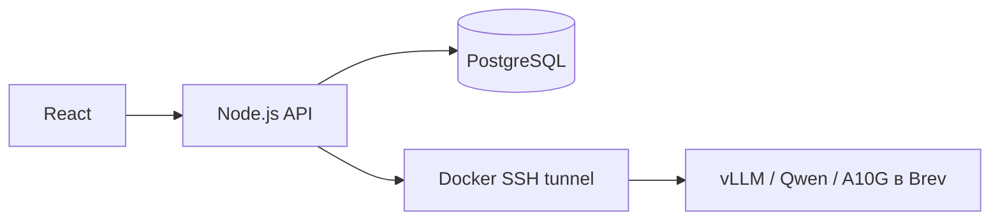

# NVIDIA Brev: ИИ-помощник Career Quest

## Развёртывание

На 23 сентября 2026 года используется существующий `career-quest-ai`: AWS `g5.xlarge`, NVIDIA A10G (23 028 MiB), 4 vCPU, 16 GiB RAM, драйвер 595.91.07, Docker 29.8.1. Состояние машины проверяется через `brev ls`.

Модель: **Qwen/Qwen3-4B-Instruct-2507**, Apache 2.0, открытое скачивание без NGC/Hugging Face ключа. Сервер: **vLLM 0.30.0**. Это самостоятельный inference на NVIDIA GPU; NIM сейчас не используется, поскольку NGC-доступ не настроен. Адаптер `self_hosted` использует стандартные Chat Completions со строгой JSON Schema; совместимый NIM можно подключить после отдельной проверки.

В `infra/brev/serve.sh` зафиксированы digest контейнера и revision модели. Контекст ограничен 8192 токенами (вход + выход), одновременно обрабатываются до двух запросов. Lazy-загрузка весов и eager-режим уменьшают требования к RAM при запуске.



Права, поиск по утверждённым статьям, контакты, расчёты навыков и проверка ответа остаются в Back. Модель выбирает разрешённые источники и факты; сервер собирает ответ. Чувствительные сценарии используют проверенные инструкции. Свободная генерация корпоративных регламентов не включена. Поиск пока SQL; OpenAI embeddings включаются отдельно.

Живые проверки и замеры: [BREV_ACCEPTANCE.md](BREV_ACCEPTANCE.md).

## Повторный запуск

Команды выполняются из корня репозитория. Нужны Docker Compose, Python 3, OpenSSH и авторизованный Brev CLI. На этом Mac CLI находится в `~/.local/bin/brev`.

```bash
brev ls
# Только если VM остановлена; запуск снова расходует кредит:
brev start career-quest-ai
brev refresh

# Первое размещение модели на уже работающем GPU:
ssh -T career-quest-ai 'bash -s' < infra/brev/serve.sh
# Контейнер перезапускается автоматически вместе с VM.
ssh -T career-quest-ai 'docker logs --tail 40 career-quest-llm'

# Получить актуальный адрес Brev и подготовить отдельный ключ туннеля:
python3 infra/brev/connect.py

python3 infra/brev/compose.py up -d --build --wait --wait-timeout 600
```

`compose.py` сохраняет настройки основного приложения: сначала передаёт Docker Compose существующий **корневой `.env`**, затем `.env.brev`. Вторая конфигурация переопределяет только заданные в ней переменные AI и туннеля; пароль БД, `APP_ORIGIN`, OIDC и другие основные настройки сохраняются. Сам wrapper не читает содержимое и не изменяет env-файлы. Экспортированные переменные shell сохраняют стандартный приоритет Compose. Если корневого `.env` нет, используются значения по умолчанию из `compose.yaml`.

Если основной запуск использует другой env-файл, укажите тот же файл перед командой Compose; относительный путь считается от текущего каталога:

```bash
python3 infra/brev/compose.py --base-env-file deploy/app.env up -d --build --wait --wait-timeout 600
```

Используйте этот параметр и для последующих `ps`, `exec`, `stop`. `Back/.env` предназначен для локального Node.js и автоматически не подключается к Compose. Wrapper всегда выбирает оба Compose-файла и корень проекта, поэтому его можно вызвать по полному пути из другого каталога. Требуется Docker Compose с поддержкой нескольких `--env-file`. Отсутствующий `.env.brev` или явно указанный основной файл останавливает запуск с пояснением. На системах, где Python 3 доступен как `python`, замените `python3` на `python`.

`serve.sh` не заменяет существующий контейнер и не вращает его ключ автоматически. Для обновления образа сначала проверить новую конфигурацию, затем явно остановить/удалить только `career-quest-llm` и повторить скрипт; сохранить `~/career-quest-ai/runtime.env` и кеш. Первый запуск скачивает около 8 ГБ весов плюс Docker-образ и может занимать несколько минут.

`connect.py` создаёт `.env.brev` и `.cache/brev/` с правами владельца. Эти пути исключены из Git и Docker build context. Существующий `Back/.env` сохраняется. Скрипт читает публичный ключ сервера через авторизованное Brev-соединение и включает строгую проверку хоста в туннеле. На VM в `authorized_keys` добавляется отдельный ключ с запретом shell/PTY и ограничением локального forwarding на `127.0.0.1:8000`. Для production используйте отдельного tunnel-пользователя с `AllowTcpForwarding local`: ограничение `permitopen` само по себе не запрещает reverse forwarding.

После stop/start адрес/порт Brev может измениться: выполните `brev refresh`, повторите `connect.py` и команду Compose. При смене ключа/known_hosts пересоздайте `ai-tunnel` через `--force-recreate`.

## Соединение и секреты

На VM опубликован только `127.0.0.1:8000`. Внешний inference-порт не открыт. Сервис `ai-tunnel` разделяет сеть контейнера Back и слушает **его** `127.0.0.1:18000`; порт не публикуется на Mac. Docker перезапускает SSH после обрыва. Для обновления Back используйте оба Compose-файла: зависимый tunnel должен перезапускаться вместе с Back.

API токен автоматически генерируется на VM в `~/career-quest-ai/runtime.env` (0600) и переносится в игнорируемый `.env.brev` без вывода на экран. Не печатайте `docker compose config`, окружение контейнеров или эти файлы: они содержат секрет. vLLM token защищает `/v1`; прочие служебные маршруты защищает приватная сеть/SSH, поэтому нельзя открывать порт 8000 публично.

Основные настройки (секрет намеренно отсутствует):

```dotenv
AI_ENABLED=true
AI_PROVIDER=self_hosted
AI_BASE_URL=http://127.0.0.1:18000/v1
AI_MODEL_FAST=Qwen/Qwen3-4B-Instruct-2507
AI_MODEL_RECOMMEND=Qwen/Qwen3-4B-Instruct-2507
AI_TIMEOUT_MS=20000
AI_MAX_CONCURRENT_REQUESTS=2
AI_EMBEDDING_ENABLED=false
```

`AI_API_KEY` обязателен и задаётся скриптом. Переадресации HTTP запрещены. OpenAI не вызывается автоматически при отказе GPU: действует детерминированный fallback. `AI_PROVIDER=openai` требует собственный ключ, модель и положительные актуальные тарифы. Не используйте ранее опубликованный ключ; для OpenAI создайте новый.

## Проверка

```bash
# Backend + настоящая GPU-модель; синтетические RU/KK вопросы, собственные временные диалоги:
python3 infra/brev/compose.py exec -T back node --input-type=module < infra/brev/smoke.mjs

# Без вывода токенов:
python3 infra/brev/compose.py ps
ssh -T career-quest-ai 'nvidia-smi --query-gpu=name,memory.used,utilization.gpu --format=csv,noheader'
```

Smoke требует `DEMO_MODE=true`, создаёт и удаляет свои диалоги, сохраняет журнал использованных запросов. Это реальные запросы на собственную GPU, OpenAI не используется. Общие backend-тесты подменяют провайдер и работают с отдельной PostgreSQL-схемой.

## Расходы и остановка

Вычисления по тарифу, зафиксированному при создании: **$1.2072/час**, хранение отдельно. Актуальный тариф и остаток — в консоли Brev. $50 соответствует примерно 41 часу GPU до учёта хранения и уже потраченного; разумно оставить $10 резерва. Загрузка, прогрев и простой работающей VM тоже оплачиваются.

`/admin/ai/usage` показывает журнал API-токенов. Для `self_hosted` стоимость токенов равна нулю, **это не означает бесплатную работу GPU**. Поля `costBasis=openai_api_tokens` и `gpuCostExcluded=true` указывают границы учёта. Ограничения запросов и параллелизма продолжают действовать. Остановка одного контейнера или туннеля не останавливает оплату VM.

```bash
# Остановить локальный tunnel перед перерывом:
python3 infra/brev/compose.py stop ai-tunnel
# Остановить оплату вычислений GPU:
brev stop career-quest-ai
```

Хранение после stop оплачивается отдельно. Удаление VM уничтожает её данные. На работающей платформе без GPU остаётся fallback по проверенным материалам.

## Размещение приложения на сервере и работа тиммейта

Текущий стек приложения работает в Docker на Mac, модель — в Brev. Окно терминала для туннеля держать открытым не нужно. Чтобы приложение работало при выключенном Mac, тот же Compose-стек, его SSH-секреты и базу нужно перенести на выбранный сервер, настроить домен, HTTPS и резервное копирование. Публичный production-сайт эта инструкция автоматически не создаёт.

Тиммейт получает код через PR и может запускать обычный `docker compose up -d --build` с fallback. Для собственной GPU-интеграции ему нужен доступ к Brev и отдельный ключ; секреты через Git не передавать. Контракт помощника описан в `contracts/GUIDE_AI.md`. Интерфейс помощника доступен по `/assistant`: фронт обращается к тому же серверу через `/api/v1`; ключи AI в браузер не передаются. Прокси ожидает ответ API до 90 секунд, включая допустимый серверный таймаут модели до 60 секунд.

## Диагностика

| Симптом | Действие |
| --- | --- |
| `AI_UNAVAILABLE` / `AI_TIMEOUT` | Проверить GPU-контейнер, `/health`, логи tunnel; дождаться прогрева |
| `AI_CONCURRENCY_LIMIT` | Заняты два inference-слота; повторить позже; после неопределённого сбоя слот сохраняется до 120 секунд |
| `401` от `/v1/models` | Проверить соответствие токена VM и `.env.brev`; повторить `connect.py` |
| SSH отказывает после stop/start | `brev refresh`, затем `connect.py`, пересоздать `ai-tunnel` |
| `INVALID_AI_RESPONSE` / `INVALID_AI_SELECTION` | Backend отклонил ответ; проверить модель на одинаковых обезличенных примерах |
| OOM | Проверить VRAM/RAM, сохранить ограничение контекста и параллелизма; не запускать вторую модель на том же GPU |
| UI без обновлённого чата | Получить актуальный main и пересобрать сервис front; экран находится по /assistant |
| Помощник использует fallback | Проверить конфигурацию AI в административных настройках и доступность модели; статус «включено» показывает конфигурацию, а не live-проверку соединения |

Источники: [модель Qwen](https://huggingface.co/Qwen/Qwen3-4B-Instruct-2507), [vLLM 0.30.0](https://github.com/vllm-project/vllm/releases/tag/v0.30.0), [Docker deployment](https://docs.vllm.ai/en/v0.30.0/deployment/docker/), [structured outputs](https://docs.vllm.ai/en/v0.30.0/features/structured_outputs/), [безопасность vLLM](https://docs.vllm.ai/en/v0.30.0/usage/security/), [стоимость состояний Brev](https://docs.nvidia.com/brev/concepts/gpu-instances).
