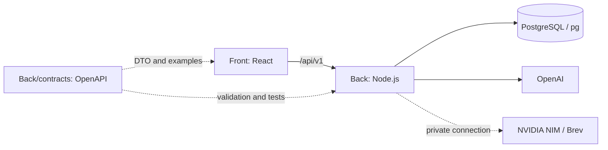

# Career Quest — два направления разработки

Статус: поэтапная реализация. В PR #3–5 добавлены основа API, SQL-схема, импорт, сессии/права, Docker, CI и стартовый Front. Полный интерфейс этапов 1–2 передан тиммейту; см. TEAM_WORK.md. Остальные функции ниже остаются планом. Объём продукта, приоритеты P0/P1/P2 и критерии приёмки определяет [TECH_SPEC.md](TECH_SPEC.md).

Команда из двух человек может вести направления параллельно. По решению команды тиммейт ведёт Front в своём Codex, текущая задача капитана ведёт Back и интеграцию. Правила веток и передачи работы — в TEAM_WORK.md.

## 1. Front — интерфейс и пользовательские сценарии

| Этап | Работа | Результат для проверки |
| --- | --- | --- |
| F1. Основа | React/Vite/TS, Tailwind, Radix, wouter, компоненты, layout, RU/KZ/EN, HTTP-клиент, обработка ошибок | Сборка проходит, навигация и адаптивная оболочка работают |
| F2. Сотрудник | Demo-вход, профиль, навыки, цель, история, каталог, доступность активностей | Профиль и выбранная цель загружаются через API |
| F3. Развитие | 1–3 рекомендации с причинами, траектория, запись, завершение, обновление прогресса | Полный сценарий сотрудника отражает актуальное состояние сервера |
| F4. HR | Фильтры, дефициты, участие, сотрудники без следующего шага, состояния пустых выборок | HR получает понятные агрегаты с drill-down по разрешённым данным |
| F5. Путеводитель | Категории ситуаций, поиск, статья, шаги действий, контакты, эскалация, обратная связь | Сотрудник находит инструкцию и понимает, кому обратиться |
| F6. Помощник | Чат, история текущего диалога, источники, контекст профиля, таймаут и fallback | Ответ сопровождается ссылками; недоступность AI объясняется пользователю |
| F7. Администрирование | Импорт с отчётом ошибок, редактор статей/контактов, публикация версий, мероприятия | Разрешённые роли управляют данными без ручного SQL |
| F8. Расширения | План развития, напоминания, наставники, командные маршруты и остальные P1/P2 по ТЗ | Каждый модуль проходит отдельную приёмку и имеет API-контракт |

Скриншоты страниц, keyboard navigation, состояния loading/empty/error и мобильный экран проверяются в каждом UI PR. Моки используются для параллельной разработки и явно отделены от интеграционного режима.

## 2. Back — данные, бизнес-логика и ИИ

| Этап | Работа | Результат для проверки |
| --- | --- | --- |
| B1. Основа | Node/TS, HTTP, конфигурация, pg.Pool, миграции, health/readiness, ошибки, OpenAPI, Docker | Сервер подключается к БД, секреты отсутствуют в ответах и логах |
| B2. Данные и права | Импорт JSON/CSV, FK, диапазоны, транзакции, demo-сессии, роли, доступ к профилям | Импорт воспроизводим, данные чужого сотрудника защищены |
| B3. Развитие | Навыки после last_review_date, цели, gaps, фильтры активности, рейтинг, история | Граничные профили дают корректные результаты без AI |
| B4. Прогресс и HR | Запись, завершение, Idempotency-Key, аудит, пересчёт, HR SQL-агрегаты | Повтор запроса не дублирует эффект; HR видит обновление |
| B5. Путеводитель | Темы, версии статей, утверждение/срок действия, контакты, правила маршрутизации, полнотекстовый поиск | Возвращаются доступные актуальные источники и проверенные контакты |
| B6. AI | OpenAI-адаптер, read-only инструменты, ограничение контекста, проверка ID/фактов, кеш, учёт бюджета, fallback | Некорректный ответ или отказ провайдера не ломает сценарий |
| B7. Управление | Импорт новых профилей, операции HR/admin, редактор справочников, аудит изменений | Данные изменяются только через проверенные операции с правами |
| B8. Расширения | NIM на Brev, очереди и интеграции при необходимости, остальные P1/P2 по ТЗ | Проверена польза расширения и стоимость эксплуатации |

Расчёты должны учитывать специфику датасета: срез `2026-10-01`, отсутствующий навык = 0, прирост не снижает уже высокий навык, обязательные события исключены из рекомендаций, допустимые повторы обработаны согласно ТЗ.

## 3. Контракт между Front и Back

- В начале реализации backend публикует `Back/contracts/openapi.yaml` и небольшие синтетические примеры успешных/ошибочных ответов. Front строит моки и DTO из этого контракта. Сам OpenAPI будет создан в PR основы API.
- Префикс `/api/v1`, JSON, формат `{ data, meta }` или `{ error: { code, message, details, requestId } }`. Даты ISO 8601; даты без времени и временные метки не смешивать.
- API и способы авторизации соответствуют разделу 7 ТЗ. Сессионные cookie требуют HttpOnly, Secure в HTTPS-среде, SameSite и защиты изменяющих запросов от CSRF. Клиент не назначает себе роль через переданный employee ID.
- Front отображает серверные значения прогресса и причины доступности. Backend единолично проверяет роли, доступность мероприятий, переходы статусов и пересчёт навыков.
- Для списков сразу согласовать пагинацию, фильтры и сортировку. Для длительных операций — статус и возможность безопасного повтора; для завершения — идемпотентность.
- Ошибки авторизации, валидации, конфликта, лимита и недоступности провайдера имеют стабильные коды. Интерфейс переводит их в понятный текст.
- Изменения контракта включают обновлённые примеры и перечень затронутых экранов. Ломающие изменения требуют синхронного обновления клиента.
- Ключи OpenAI/NIM, SQL и NGC-ключ находятся на сервере/VM. Браузер обращается только к нашему API.

## 4. Порядок интеграции

1. **Основа:** F1 + B1. Раздельные package/lock-файлы, Vite proxy, Docker Compose с `Front`, `Back` и PostgreSQL, CI. В каждый Docker build context добавить `.dockerignore`, исключающий `.env*` и локальные данные.
2. **Вертикальный сценарий:** B2 + F2. Один сотрудник входит, получает профиль и меняет цель; затем подключается весь датасет.
3. **Обязательный кейс:** B3/B4 + F3/F4. Рекомендация → завершение → прогресс → HR. Сначала корректные расчёты, затем AI-объяснения.
4. **Путеводитель:** B5 + F5. Синтетические статьи и контакты явно помечены. Пример ситуации: проблема с доступом → безопасные шаги → команда поддержки → правило эскалации.
5. **ИИ:** B6 + F6. Ответы по разрешённому профилю и утверждённым статьям; ссылка на источник, отсутствие выдуманных регламентов, контролируемые расходы.
6. **Управление:** B7 + F7. Администратор импортирует проверочные профили и публикует знания без изменения кода.
7. **Расширения:** F8/B8. Brev включается после работающего базового сценария; качество и задержка сравниваются на одинаковом наборе вопросов.

## 5. Правила Git и готовности

- Ветки `codex/front-<задача>`, `codex/back-<задача>` или `codex/integration-<задача>` создаются от актуального `main`.
- Каждая законченная задача — отдельный PR с описанием, способом проверки и ссылкой на пункт ТЗ. Имена этапов выше не являются номерами GitHub PR.
- Front и Back имеют независимые проверки типов/сборки. Контракт, миграции и сквозной сценарий проверяются совместно в CI по мере появления кода.
- Front PR содержит скриншоты; Back PR — миграции при изменении схемы и результаты проверок затронутых бизнес-правил.
- Перед слиянием работают интеграционный сценарий и обязательные проверки. В `main` попадает воспроизводимая версия.
- Оригинальный `docs/` остаётся локальным; четыре синтетических файла и их README скопированы в `Back/data/` для приватного репозитория хакатона. CI импорта использует эту копию.

## 6. Бюджеты AI

OpenAI и Brev имеют отдельные бюджеты по $50. Рабочий ориентир для каждого — $40 на эксперименты и $10 резерв. Это планирование, а не гарантия автоматического отключения.

OpenAI: сервер учитывает токены/расходы, ограничивает частоту и длину ответов, кеширует рекомендации, отключает платные вызовы при достижении лимита. Настройки провайдера дополнительно контролируются в кабинете.

Brev: расходы определяются временем работы GPU и хранилищем. Перед запуском проверить цену; после эксперимента остановить VM и проверить billing. Ключ OpenAI не применяется для входа в Brev или скачивания NIM.
