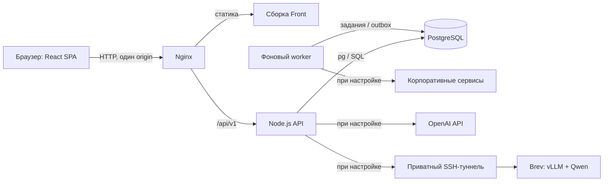

# Career Quest

**AI-навигатор развития сотрудника** — проект команды **Smart IT Solution** для **HackAlem.ai**, трек **03 — «Управление»**, кейс Halyk Bank.

Career Quest связывает карьерную цель, навыки и корпоративное обучение в один маршрут: сотрудник видит, чего ему не хватает для выбранной роли, получает объяснимые рекомендации и отслеживает результат. Путеводитель и помощник помогают находить рабочие инструкции и нужные контакты, а руководитель и HR видят развитие команды.

| Роль в команде | Участник |
| --- | --- |
| Капитан | Болат Қуаныш Болатұлы |
| Участник | Елеуов Ернар |

**Быстрый старт:** [запуск в Docker](#установка-и-запуск) → [сценарий для жюри](#как-проверить-решение).

## Какую проблему решаем

Разрозненные курсы и HR-уведомления не объясняют сотруднику, какой следующий шаг приблизит его к профессиональной цели. HR при этом сложно увидеть, какие навыки требуют внимания и как сотрудники проходят путь от рекомендации до завершения обучения.

Платформа предназначена для сотрудников, руководителей, HR и администраторов организации. Она объединяет профиль компетенций, каталог активностей, индивидуальные планы, рабочие инструкции и аналитику участия.

## Что реализовано

Frontend подключён к API и PostgreSQL. Ниже перечислены возможности текущего кода; условия работы внешних сервисов описаны в разделе [интеграций](#данные-и-интеграции).

| Раздел | Возможности |
| --- | --- |
| **Карьера и навыки** | Профиль, текущая роль и грейд, выбор карьерной цели, история целей, требуемые и расчётные уровни навыков, разрывы и прогресс. |
| **Рекомендации** | До трёх подходящих активностей с объяснением выбора и ожидаемым приростом навыков; учёт требований цели, истории, предварительных условий, длительности и доступности. |
| **Обучение** | Поиск и фильтры каталога, карточки мероприятий, сессии и вместимость, запись и очередь, начало и завершение, отказ и перенос, история участия. |
| **Планы развития** | Планы на 30/90/180 дней, предпочтения и бюджет времени, сравнение целей, моделирование развития, подбор наставников и согласование. |
| **Задания и достижения** | Личные задания, достижения, благодарности с модерацией, командные активности, баллы и награды по настроенной политике. |
| **Путеводитель сотрудника** | Поиск рабочих ситуаций, статьи и контекстные подсказки, контакты и маршруты эскалации, обратная связь. Для редакторов — версии, переводы, публикация и срок актуальности. |
| **ИИ-помощник** | Личные диалоги на русском, казахском и английском, история и удаление; ответы по доступным фактам профиля и опубликованным инструкциям со ссылками на источники. |
| **HR-аналитика** | Разрывы навыков, сотрудники без следующего шага, участие и воронка обучения, сравнение программ, история оценок, сигналы участия, моделирование команды; ROI при наличии подтверждённых финансовых данных. |
| **Администрирование** | Управление мероприятиями, базой знаний, программами развития и аккаунтами; импорт с предпросмотром и историей, аудит, расходы ИИ, настройки интеграций и семантического поиска. |
| **Уведомления и интерфейс** | Личные уведомления, напоминания, экспорт календаря `.ics`, адаптивная навигация, интерфейс RU/KK/EN, установка PWA и публичный офлайн-экран. |

### Вход и права доступа

Доступны демо-вход, обычный логин/пароль и подключаемый OIDC. Права проверяются сервером для каждого запроса.

| Роль | Область доступа |
| --- | --- |
| Сотрудник | Собственный профиль, обучение, цели, планы и личные диалоги. |
| Руководитель | Собственный профиль и прямые подчинённые; обзор команды и её участия. |
| HR | Профили организации, аналитика, управление мероприятиями, базой знаний и программами развития. |
| Администратор | Дополнительно аккаунты, импорт, аудит, интеграции и настройки ИИ. |

Сессии хранятся в HttpOnly cookie. Изменяющие запросы защищены проверкой Origin и CSRF; поддерживаемые операции используют ключи идемпотентности. Пароли хешируются через `scrypt`, секреты провайдеров остаются на сервере.

## Как работает решение

1. **Входные данные:** профиль сотрудника, оценённые навыки, требования к ролям и грейдам, каталог обучения и история участия загружаются в PostgreSQL.
2. **Цель:** сотрудник выбирает должность и грейд. Система сравнивает требования цели с его актуальными расчётными навыками.
3. **Следующий шаг:** алгоритм отбирает доступные мероприятия, исключает неподходящие и ранжирует оставшиеся по закрытию разрывов, критичности навыков, цели, истории и длительности. Возвращает **1–3 рекомендации**, если подходящие варианты есть.
4. **Действие:** сотрудник записывается на мероприятие и проходит его. Сервер проверяет условия участия, вместимость и переходы статусов.
5. **Результат:** после завершения пересчитываются навыки и прогресс; история сохраняет связь изменения с конкретной активностью. HR видит фактическое участие и агрегаты в пределах своих прав.

Расчётные навыки воспроизводятся из исходной оценки и последующих завершений. Эффект мероприятия сохраняется на момент завершения, поэтому редактирование каталога не переписывает прошлые результаты. Процент прогресса показывает покрытие требований цели; решение о повышении остаётся за организацией.

### Как устроен помощник

Backend получает разрешённые данные сотрудника и актуальные опубликованные статьи. При включённом ИИ модель формулирует связный ответ на их основе и указывает использованные источники и факты. Сервер проверяет идентификаторы и доступность источников, добавляет ссылки и отмечает демонстрационные материалы. Для уточняющих вопросов передаются последние 12 реплик диалога с ограничением длины и удалением персональных идентификаторов. Помощник не выполняет административные действия за пользователя.

- **Без ключей и GPU:** работают поиск и ответы по проверенным данным платформы с явной отметкой о резервном режиме.
- **NVIDIA Brev:** в репозитории зафиксирована и проверена конфигурация **Qwen/Qwen3-4B-Instruct-2507 → vLLM 0.30.0 → NVIDIA A10G**, доступная backend через приватный SSH-туннель.
- **OpenAI:** реализован альтернативный провайдер через Responses API. Модель и ключ задаются серверной конфигурацией. Автоматического переключения с GPU на платный OpenAI при сбое нет.
- **Поиск по смыслу:** OpenAI embeddings включаются отдельно, после индексации и проверки качества. По умолчанию используется поиск через SQL.

Для обращений к моделям предусмотрены таймауты, лимиты, учёт использования и резервный ответ. Стоимость аренды GPU учитывается в Brev отдельно от журнала токенов приложения.

## Технологии

| Компонент | Стек |
| --- | --- |
| Frontend | React **19.2**, TypeScript **5.9**, Vite **7**, `wouter`. |
| Интерфейс | Tailwind CSS **4**, Radix UI, `class-variance-authority`, `tailwind-merge`, Lucide. |
| Backend | Node.js **24.19.0**, TypeScript, встроенный `node:http`, Zod, `csv-parse`, `jose`. |
| База данных | PostgreSQL **17** в Docker Compose; `pg`, обычный SQL и SQL-миграции, без ORM. |
| ИИ | Qwen3-4B-Instruct-2507, vLLM, NVIDIA Brev; альтернативно OpenAI Responses API; отдельно OpenAI Embeddings API. |
| Инфраструктура | Docker Compose, Nginx, фоновый worker, SSH-туннель для частного GPU endpoint. |
| Проверки | Node.js Test Runner через `tsx`, Playwright, проверки типов и production-сборки. |

Зависимости зафиксированы в `Front/package-lock.json` и `Back/package-lock.json`; версия Node — в `.nvmrc` и Dockerfile.

## Архитектура проекта



- **Front** отображает данные API, хранит состояние интерфейса и отправляет запросы с cookie и CSRF. В разработке `/api` проксирует Vite, в контейнерах — Nginx.
- **Back** отвечает за авторизацию, карьерные расчёты, участие, рекомендации, путеводитель, аналитику и проверку ответов ИИ.
- **PostgreSQL** хранит профили, требования к навыкам, мероприятия, участия, планы, статьи, диалоги, сессии, аудит и очередь внешних событий. Связи и ограничения заданы миграциями.
- **Worker** обрабатывает напоминания и исходящие события; доставка в сторонние системы включается конфигурацией.
- **ИИ-провайдер** подключается только к backend. Основной карьерный сценарий доступен и без него.

```text
Front/                       React-приложение и браузерные тесты
Back/
  src/                       API, бизнес-логика, worker, провайдеры ИИ
  db/                        SQL-миграции
  data/                      Синтетический набор для демонстрации
  contracts/                 Документация API
  tests/                     Серверные тесты
infra/                       Nginx, Dockerfile фронтенда, запуск Brev
compose.yaml                 Локальный стек: db, back, worker, front
compose.brev.yaml            Дополнительный приватный туннель к GPU
```

## Установка и запуск

### 1. Требования

Для демонстрации нужны **Git, Docker Engine / Docker Desktop и Docker Compose v2**, а также доступ к репозиторию. Системный Node.js и ключи ИИ для этого способа запуска не требуются. Порты `8080`, `3001` и `5433` должны быть свободны.

### 2. Получить проект

```bash
git clone https://github.com/BAITC-Hacks/hack-e61371a2-smart-it-solution.git
cd hack-e61371a2-smart-it-solution
```

### 3. Собрать и запустить

```bash
docker compose up -d --build --wait
docker compose ps
```

При первом запуске backend автоматически применяет миграции и загружает демонстрационный набор. Данные сохраняются в volume PostgreSQL; повторный запуск не дублирует импорт.

### 4. Открыть приложение

**[http://localhost:8080](http://localhost:8080)**

На странице входа выберите **«Сотрудник»**, **«Руководитель»**, **«HR»** или **«Администратор»**. В демо-режиме пароль не требуется. Соответствующие логины: `demo.employee`, `demo.manager`, `demo.hr`, `demo.admin`.

Проверка готовности API через тот же Nginx, которым пользуется frontend:

```bash
curl --fail http://localhost:8080/api/v1/health/ready
# Ожидается: {"data":{"status":"ready"}}
```

Стандартный Compose запускает демо с `DEMO_MODE=true`, `AI_ENABLED=false` и выключенной внешней доставкой. Все опубликованные порты привязаны к localhost. В этой конфигурации можно проверить карьерный сценарий, данные, интерфейс и резервные ответы помощника.

### 5. Остановка и диагностика

```bash
docker compose logs --tail 50 back
docker compose stop
# Вернуть существующие контейнеры в работу:
docker compose up -d --wait
```

`docker compose down` удаляет контейнеры, сохраняя БД. Добавление `-v` удаляет и данные volume.

### Запуск разработки и подключение ИИ

- Для разработки вне контейнеров установите **Node.js 24.19.0** (`nvm install && nvm use`). Пошаговые команды, `.env.example` и миграции: [Back/README.md](Back/README.md); запуск Vite на `5173`: [Front/README.md](Front/README.md).
- OpenAI включается серверной конфигурацией: ключом, выбранной моделью, лимитами и `AI_ENABLED=true`. Параметры — в [Back/.env.example](Back/.env.example). Ключи не нужны frontend.
- Для подготовленной NVIDIA Brev VM используйте [инструкцию](Back/NVIDIA_BREV_SETUP.md). После настройки локальных секретов и SSH запуск выполняется обёрткой, сохраняющей параметры основного `.env` и `.env.brev`:

```bash
python3 infra/brev/compose.py up -d --build --wait --wait-timeout 600
```

Эта команда требует Python 3 и уже настроенную VM; обычный демо-запуск из шага 3 не создаёт GPU-инстанс.

## Как проверить решение

### Основной сценарий для жюри

Пример рассчитан на свежую демо-БД. Уже завершённый курс нельзя использовать для повторного начисления навыка.

1. Войдите как **«Сотрудник»** — это `demo.employee`, **Marat Yessenov / E0001**, Backend Engineer, Junior. Выберите **RU** в переключателе языка.
2. Откройте **«Карьера и навыки» → «Выбрать цель»**. Выберите **Backend Engineer / Senior**, нажмите **«Подтвердить»** и подтвердите диалог. Посмотрите требования и разрывы навыков.
3. В **«Рекомендации для цели»** нажмите **«Подобрать обучение»** или **«Обновить»**. Проверьте объяснения и ожидаемые изменения навыков у предложенных мероприятий.
4. Через каталог **«Обучение»** откройте **Advanced Python** (`/events/EV_012`). Это самостоятельное мероприятие, доступное данному сотруднику; попадание именно этого курса в первые три рекомендации не требуется.
5. Выполните **«Записаться» → «Начать» → «Завершить»**, подтверждая действия. Откройте **«История обучения»** и снова **«Карьера и навыки»**: расчётный **Python изменится с 3 до 4**, разрыв по этому навыку до требований Senior уменьшится на 1. Для этого примера ждать даты сессии не нужно.
6. В **«Путеводитель»** найдите инструкцию по ноутбуку и проверьте источники и контакты. В **«Помощник»** создайте диалог и спросите: **«Какая у меня текущая роль и грейд?»** или **«Что указано в демонстрационной инструкции про ноутбук?»**. Ответ должен содержать доступные факты или ссылки; при выключенном ИИ интерфейс явно сообщает об этом.
7. Выйдите и войдите как **«HR»**. В **«HR-аналитика»** проверьте разрывы навыков и участие сотрудников. Затем войдите как **«Руководитель»** и сравните область доступных профилей.

Для дополнительной проверки администратор может открыть импорт, отправить JSON/CSV на предпросмотр и увидеть ошибки или различия **до** применения данных. В тестах имеются отдельные сценарии с подготовкой исходного состояния: [Front/tests/README.md](Front/tests/README.md).

### Автоматические проверки

В каждой папке установите зависимости через `npm ci`. Проверка типов и сборки из корня:

```bash
(cd Back && npm run typecheck && npm run build)
(cd Front && npm run typecheck && npm run build)
```

Backend: `npm test` из `Back`; для тестов с БД задайте `TEST_DATABASE_URL` к тестовой PostgreSQL с правом создавать схемы. Без него проверки БД пропускаются. Инструкции: [Back/README.md](Back/README.md).

Frontend: `npx playwright install chromium`, затем `npm run test:e2e` из `Front`. По умолчанию это проверки с моками API; сценарии с реальным backend требуют отдельной тестовой БД и параметров из [инструкции тестов](Front/tests/README.md).

Зафиксированные результаты приёмки:

- [Интеграционная проверка от 23.09.2026](INTEGRATION_VERIFICATION.md): 21 браузерный тест с моками API, 16 с реальными frontend/backend/PostgreSQL, 2 проверки PWA/CSP; 35 серверных проверок AI/semantic/capability с замоканными провайдерами, 10 проверок обёртки Brev, сборки и типы. Внешние сервисы в этой приёмке не вызывались.
- [Отдельная приёмка NVIDIA Brev](Back/BREV_ACCEPTANCE.md): backend-тесты, живые RU/KK-запросы к Qwen на GPU, проверка источников, авторизации модели, повторов запросов и приватного туннеля. Это проверка конкретной конфигурации, а не нагрузочный benchmark.

## Данные и интеграции

### Демонстрационный набор

| Источник | Содержимое |
| --- | --- |
| `Back/data/employees.json` | 200 синтетических сотрудников. |
| `Back/data/skills.json` | 60 навыков и 32 профиля требований: 8 профессий × 4 грейда. |
| `Back/data/events.json` | 40 мероприятий, условия участия и эффекты обучения. |
| `Back/data/activity_history.csv` | 2 743 записи участия за 01.10.2024–30.09.2026. |
| Демонстрационная база знаний | 15 статей: 5 рабочих ситуаций × русский, казахский и английский. |

**Дата среза — 01.10.2026.** Карьерные расчёты и доступность сессий используют этот срез, а сроки авторизации и лимиты ИИ — реальные часы. Уровни навыков имеют шкалу **0–5**. Схемы и связи описаны в [Back/data/README.ru.md](Back/data/README.ru.md).

Набор синтетический и предоставлен для хакатона. По условиям кейса его нельзя выносить за пределы хакатона; реальные персональные данные не используются. Исходные материалы `docs/` остаются локальными.

### Внешние подключения

| Интеграция | Что есть в проекте и что требуется |
| --- | --- |
| OpenAI / NVIDIA Brev | Серверные провайдеры ИИ. Требуются ключи или подготовленная GPU VM; Brev-конфигурация проверена отдельно. |
| LMS / HRIS | Импорт нормализованных пакетов, сопоставление внешних ID, проверка и история. Конкретная корпоративная система по умолчанию не подключена. |
| Корпоративный вход | OIDC-адаптер; требуется настройка identity provider организации. |
| Webhooks и мессенджер | Подписанные HMAC события, outbox, повторы доставки и протокол relay. Нужны внешние endpoints и секреты. |
| IT / HR-обращения | Адаптер создания обращений и маршруты из путеводителя. Без настроенного провайдера внешняя заявка не создаётся. |
| Календарь | Экспорт `.ics` для собственных активностей. События на весь день: в исходных данных нет времени и часового пояса. |

Контракты: [API](Back/contracts/README.md), [путеводитель и помощник](Back/contracts/GUIDE_AI.md), [интеграции](Back/contracts/PLATFORM_INTEGRATIONS.md).

## Ограничения текущей версии

- Демонстрация использует синтетические данные. Реальные регламенты, контакты и подключения организации нужно загрузить и настроить отдельно.
- Навыки и ожидаемый эффект обучения рассчитываются по заданной модели. Они не заменяют оценку компетенций; моделирование не гарантирует повышение, а сигналы участия не являются прогнозом увольнения.
- Если подходящих активностей нет, рекомендации возвращают объяснимое пустое состояние. Завершение обязательного мероприятия без эффекта на навыки не увеличивает карьерный прогресс.
- Качество ответа помощника ограничено разрешёнными источниками. При отключении, ошибке или превышении лимитов ИИ используется обозначенный резервный ответ. Семантический поиск требует отдельной подготовки и проверки качества.
- Внешние OIDC, LMS/HRIS, мессенджеры и системы заявок не настроены в стандартном демо. Финансовый ROI доступен только при наличии подтверждённых исходных данных.
- Интерфейс поддерживает RU/KK/EN, но перевод корпоративной статьи или мероприятия должен быть опубликован в API; иначе показывается оригинал.
- PWA предоставляет установку и публичный офлайн-экран. Личный кабинет и API требуют сети; персональные данные не кешируются для офлайн-работы.
- Для публичной эксплуатации нужны отдельная конфигурация HTTPS, рабочие аккаунты, `DEMO_MODE=false`, `COOKIE_SECURE=true` и серверные секреты. Локальный Compose — конфигурация демонстрации.

## Развёрнутая версия

**Публичная ссылка: [https://82.115.42.241](https://82.115.42.241).**

На странице входа выберите **«Попробовать демо»** и одну из четырёх ролей: **сотрудник, руководитель, HR или администратор**. Пароль не требуется; демонстрационные данные общие для посетителей.

Frontend, backend, PostgreSQL и фоновый worker развёрнуты на сервере в Docker. Приложение доступно по HTTPS, а ИИ-помощник подключён к Qwen на NVIDIA Brev через приватный SSH-туннель. После локального запуска приложение также доступно на [http://localhost:8080](http://localhost:8080).

## Документация и совместная разработка

- [Техническое задание и подробная архитектура](TECH_SPEC.md).
- [План разработки](DEVELOPMENT_PLAN.md).
- [Frontend](Front/README.md) и [backend](Back/README.md).
- [Запуск NVIDIA Brev](Back/NVIDIA_BREV_SETUP.md).
- [Правила совместной работы](TEAM_WORK.md): отдельные ветки `codex/*`, проверка изменений через pull request.

Плановые возможности из технического задания не считаются автоматически реализованными. Состав текущей версии описан выше и подтверждается кодом, API-контрактами и отчётами проверки.
