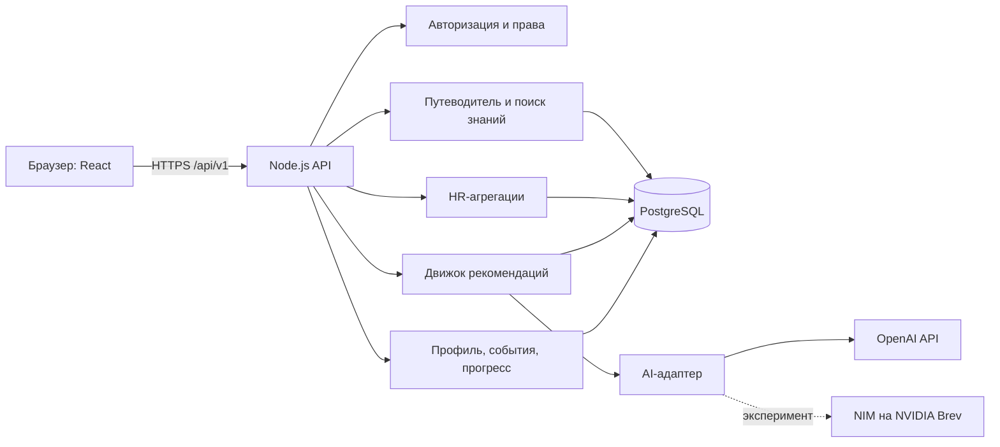
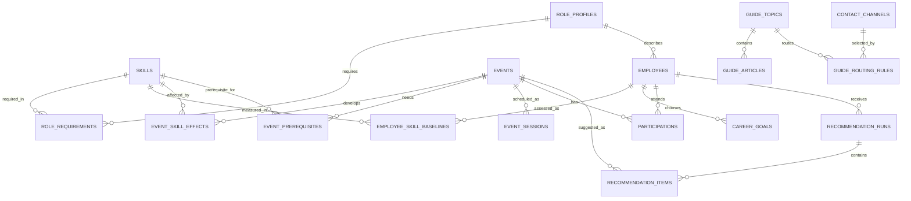

# Career Quest — техническое задание

- **Проект:** Smart IT Solution / HackAlem.ai / трек 03 «Управление» / кейс Halyk Bank «Career Quest»
- **Версия документа:** 1.0
- **Статус:** проектная спецификация для реализации через pull request
- **Команда:** Болат Қуаныш Болатұлы, Елеуов Ернар

## 1. Назначение и границы

Career Quest — веб-платформа, которая помогает сотруднику понять требования к карьерной цели, выбрать полезные развивающие активности и увидеть результат после их выполнения. Дополнительный модуль «Путеводитель сотрудника» помогает решить типовые рабочие вопросы: что делать, где найти инструкцию и к кому обратиться. HR получает агрегированную картину дефицита компетенций и участия в активностях. Ключевая ценность карьерного контура — релевантные, проверяемые и объяснимые рекомендации.

Документ разделяет три уровня требований:

- **P0 — обязательное ядро:** сценарии и ограничения из технического задания, необходимые для защиты.
- **P1 — платформа:** функции, делающие ядро полноценным продуктом.
- **P2 — расширения:** функции, которые внедряются после стабильного P0/P1. Их реализация зависит от времени и наличия дополнительных данных.

Критерий готовности P0: приложение запускается одной командой, загружает исходный и дополнительные проверочные профили, показывает траекторию, предлагает 1–3 объяснимых шага, обновляет прогресс и предоставляет HR-экран.

### 1.1. Источники требований

- Локальное техническое задание: `docs/ТЕХНИЧЕСКОЕ ЗАДАНИЕ.docx`.
- Описание данных: `docs/career_quest_dataset/README.ru.md` (также есть версии на английском и казахском).
- Стартовые файлы: `skills.json`, `employees.json`, `events.json`, `activity_history.csv` в `docs/career_quest_dataset/`.

Папка `docs/` сейчас существует локально и не входит в Git. Для воспроизводимой проверки нужно добавить разрешённые данные в приватный репозиторий или документировать их получение. Синтетические данные за пределы хакатона не выносятся; реальные персональные данные не используются.

### 1.2. Входные данные и особенности

| Источник | Содержание | Объём |
| --- | --- | ---: |
| `skills.json` | 60 навыков, шкала 0–5, 8 ролей × 4 грейда и их требования | 60 навыков, 32 профиля |
| `employees.json` | Роль, грейд, навыки, цель, руководитель, язык, дата оценки | 200 сотрудников |
| `events.json` | Мероприятия, аудитория, навыки, прирост, ограничения, сессии | 40 мероприятий |
| `activity_history.csv` | Участие, статусы, оценки, пропуски и отказы | 2 743 записи |

Дата среза `2026-10-01` считается «сегодня» **для расчётов по датасету**, независимо от даты запуска приложения. История охватывает `2024-10-01` — `2026-09-30`. Дополнительные профили и записи истории на защите имеют ту же схему. Отсутствующий в профиле навык имеет уровень 0.

Выявленные пограничные случаи: у 66 сотрудников нет цели; 28 целей ведут в другую роль; 318 записей `completed` произошли после `last_review_date`. В истории есть повторные завершения обязательных `EV_001`–`EV_003`, хотя README в общем правиле разрешает повтор только для `EV_036`. Для логики рекомендаций обязательные мероприятия исключаются; повторные обязательные прохождения сохраняются как отдельные циклы комплаенс-обучения. Решение не должно скрывать это расхождение данных.

## 2. Пользователи, права и сценарии

| Роль приложения | Доступ | Основной сценарий |
| --- | --- | --- |
| Сотрудник | Собственный профиль, цель, рекомендации, история, каталог | Понять, что делать дальше и зачем |
| HR | Разрешённые профили и агрегированные показатели, управление мероприятиями | Найти дефицит компетенций и проблемы участия |
| Руководитель (P1) | Сотрудники своей команды при включённом доступе | Обсудить план развития без публичного сравнения людей |
| Администратор | Импорт, настройки, учётные записи и техническое состояние | Поддерживать данные и доступ |

Права приложения не выводятся из поля `employees.role`: «Backend Engineer» — профессия сотрудника, а `employee`/`hr`/`admin` — роль доступа. Для демонстрации создаются отдельные тестовые учётные записи. Публичных рейтингов сотрудников нет. Данные о вовлечённости других сотрудников не показываются обычному сотруднику без разрешения.

### 2.1. Основные пользовательские потоки

1. **Сотрудник:** вход → профиль → цель → разрывы навыков → 1–3 рекомендации → объяснение → запись/завершение → обновлённый прогресс.
2. **Сотрудник без цели:** вход → выбор следующего грейда или другой роли → расчёт требований → рекомендации. Для `Lead` без цели система предлагает выбор направления, не выдумывая следующий грейд.
3. **HR:** вход → обзор компетенций → фильтр по роли/грейду/отделу → сотрудники без следующего шага → детализация участия.
4. **Жюри/администратор:** загрузка проверочных профилей и истории → отчёт о валидации → открытие импортированного сотрудника → повторяемый расчёт рекомендации.
5. **AI-помощник (P1):** вопрос о собственном развитии → чтение разрешённых данных → ответ с конкретными факторами и ссылками на элементы интерфейса.
6. **Путеводитель (P1):** сотрудник описывает рабочую ситуацию → поиск утверждённой инструкции → последовательность действий, актуальный контакт или канал обращения → при отсутствии надёжного ответа передача вопроса человеку.

## 3. Функциональные требования

### 3.1. Импорт и качество данных

| ID | Приоритет | Требование и проверка |
| --- | --- | --- |
| DATA-01 | P0 | Импортировать четыре исходных файла; валидировать JSON/CSV, типы, обязательные поля и диапазоны значений. Ошибки показывать с именем файла, записью и полем. |
| DATA-02 | P0 | Проверять уникальность ID и ссылки между сотрудниками, навыками, профилями ролей, мероприятиями и историей. Некорректный пакет не применять частично. |
| DATA-03 | P0 | Принимать дополнительные профили и историю в той же схеме без хардкода ID и размера датасета. |
| DATA-04 | P0 | Учитывать дату среза из `meta.as_of_date`; будущими считать только сессии после неё. |
| DATA-05 | P1 | Повторный импорт того же файла определять по SHA-256; не создавать дубли. Хранить версию и результат импорта. |
| DATA-06 | P1 | Показывать предпросмотр импорта: новые/изменённые записи, ошибки и предупреждения; применять пакет отдельным действием. |
| DATA-07 | P1 | Сохранять источник и время изменения бизнес-данных, предоставлять восстановление тестового состояния. |

### 3.2. Профиль и траектория

| ID | Приоритет | Требование и проверка |
| --- | --- | --- |
| EMP-01 | P0 | Показывать роль, грейд, стаж, навыки 0–5, завершённые активности и доступные шаги произвольного сотрудника. |
| EMP-02 | P0 | Сравнивать навыки с профилем целевой роли/грейда; отмечать критические навыки и величину каждого разрыва. |
| EMP-03 | P0 | Показывать траекторию и текущий прогресс, не выдавая рекомендацию за решение о повышении. |
| EMP-04 | P1 | Позволять выбрать или изменить карьерную цель, в том числе переход в другую роль; отсутствие цели обрабатывать явно. |
| EMP-05 | P1 | Показывать историю по статусам `completed`, `in_progress`, `dropped`, `no_show`, `declined`, `overdue` и обязательные задачи отдельно. |
| EMP-06 | P1 | Различать оценённый уровень навыка на `last_review_date` и рассчитанный актуальный уровень после последующих завершений. |
| EMP-07 | P1 | Давать фильтры, поиск, описание шкалы 0–5 и доступный с клавиатуры интерфейс. |

### 3.3. Каталог и участие

| ID | Приоритет | Требование и проверка |
| --- | --- | --- |
| EVT-01 | P1 | Каталог с поиском и фильтрами по роли, грейду, навыку, типу, формату, длительности и доступности. |
| EVT-02 | P0 | Карточка показывает развиваемые навыки, `gain`, `max_level`, предварительные требования и ближайшие сессии. |
| EVT-03 | P0 | Мероприятие допустимо только при совпадении аудитории и выполнении `prerequisites`; причина недоступности отображается. |
| EVT-04 | P0 | После `completed` мероприятие не рекомендовать повторно, кроме `EV_036`. Периодические обязательные `EV_001`–`EV_003` вести отдельно от добровольных рекомендаций. |
| EVT-05 | P1 | Поддержать запись, начало, завершение и отказ как разные изменения статуса; не смешивать историческую запись с новой регистрацией. |
| EVT-06 | P1 | Для `self_paced` не требовать `upcoming_sessions`; для мероприятий по расписанию выбирать актуальную будущую сессию. |
| EVT-07 | P1 | После ошибочного завершения разрешить корректировку авторизованному пользователю с обязательной записью в аудит. |

### 3.4. Рекомендации и AI

| ID | Приоритет | Требование и проверка |
| --- | --- | --- |
| REC-01 | P0 | Возвращать 1–3 релевантные добровольные активности, если допустимые кандидаты есть. |
| REC-02 | P0 | Выбор должен учитывать грейд, разрывы навыков, историю участия и требования следующего уровня; однофакторное правило не принимается. |
| REC-03 | P0 | Объяснение каждой рекомендации содержит проверяемые факты минимум из трёх разных факторов и ожидаемый результат по навыкам. |
| REC-04 | P0 | Новые проверочные профили должны влиять на результат через данные, без ручных исключений по ID. |
| REC-05 | P0 | Нельзя возвращать несуществующий, обязательный или недоступный `event_id`; ответ модели повторно валидируется сервером. |
| REC-06 | P1 | Показывать варианты, причины отклонения кандидатов и осмысленное состояние «подходящих активностей нет». |
| REC-07 | P1 | При смене цели, завершении активности или новом импорте пересчитывать устаревшие рекомендации. |
| REC-08 | P1 | При сбое AI или превышении бюджета использовать детерминированный резервный рейтинг и явно обозначать источник объяснения. |
| REC-09 | P1 | Сохранять версию алгоритма, входной хеш, модель, допустимые ID, итоговый порядок, задержку, токены и ориентировочную стоимость. |
| REC-10 | P1 | Собирать обратную связь «полезно/не подходит» и причину, не превращая отказ в автоматическую санкцию для сотрудника. |

### 3.5. Прогресс, HR и помощник

| ID | Приоритет | Требование и проверка |
| --- | --- | --- |
| PROG-01 | P0 | После `completed` пересчитывать навыки по `gain` с ограничением `max_level`, затем пересчитывать траекторию. |
| PROG-02 | P0 | Повторное выполнение API-запроса не начисляет прогресс второй раз. |
| PROG-03 | P1 | Хранить историю изменений и объяснять, какая активность повлияла на конкретный навык. |
| HR-01 | P0 | Показывать часто проседающие навыки, сотрудников без рекомендованного шага и участие по активностям. |
| HR-02 | P1 | Фильтровать агрегаты по отделу, роли, грейду и периоду; ограничивать детализацию правами. |
| HR-03 | P1 | Создавать и редактировать мероприятия с предпросмотром влияния на доступность и каталог. |
| AI-01 | P1 | Помощник отвечает на вопросы о профиле, цели, навыках и рекомендациях, используя только разрешённые данные. |
| AI-02 | P1 | Ответ помощника ссылается на реальные навыки, мероприятия и расчёты; действия с изменением данных выполняются через обычный API и явное подтверждение в UI. |
| AI-03 | P1 | Ограничивать число запросов, длину контекста и расходы на пользователя и на проект. |

### 3.6. Путеводитель сотрудника и рабочие ситуации

Путеводитель — самостоятельный раздел платформы и источник проверенных ответов для AI-помощника. Он не должен выдавать придуманные внутренние правила или контакты. Реальные регламенты, адреса и ответственные подразделения утверждаются организацией; до этого используются явно помеченные синтетические демонстрационные статьи.

| ID | Приоритет | Требование и проверка |
| --- | --- | --- |
| GUIDE-01 | P1 | Дать каталог ситуаций с категориями, поиском, тегами и вариантами языка `ru`/`kk`/`en`. |
| GUIDE-02 | P1 | Для каждой статьи показывать: когда она применима, пошаговые действия, необходимые документы/ссылки, кому обращаться первым, запасной канал, дату обновления и владельца материала. |
| GUIDE-03 | P1 | Дать сотруднику поиск по свободной формулировке («сломался ноутбук», «как взять отпуск») с переходом к проверенной статье. |
| GUIDE-04 | P1 | AI отвечает только по опубликованным статьям и доступному профилю, приводит название/ссылку/дату источника и не выдумывает контакты. |
| GUIDE-05 | P1 | Если утверждённого ответа нет, статья устарела или ситуация неоднозначна, показать подходящий человеческий канал либо нейтральное сообщение о необходимости уточнения. |
| GUIDE-06 | P1 | HR/администратор создаёт черновик, проверяет, публикует, обновляет и архивирует статью; видна история версий. |
| GUIDE-07 | P1 | Контакты и правила маршрутизации хранятся отдельно от текста статьи, чтобы смена ответственного обновлялась централизованно. |
| GUIDE-08 | P1 | Сотрудник оценивает полезность ответа и сообщает об устаревшем контакте или неверной инструкции. |
| GUIDE-09 | P2 | Создание заявки в IT/HR-системе и отслеживание её статуса после подключения реальной интеграции. |
| GUIDE-10 | P2 | Контекстные подсказки по этапу работы: первые дни, приближение оценки, смена роли, начало обучения, завершение активности. |

Рекомендуемый перечень тем для наполнения путеводителя:

| Ситуация | Что должна содержать статья | Тип ответственного канала для проверки организацией |
| --- | --- | --- |
| Первый рабочий день, адаптация | Чеклист, доступы, обязательные мероприятия, знакомство с командой | Руководитель, HR/онбординг |
| Не работает ноутбук, VPN, почта или доступ | Базовая безопасная проверка, способ создать заявку, срочный канал | IT-поддержка |
| Обнаружен подозрительный файл или возможная утечка | Немедленные действия без самостоятельного расследования, срочный канал | Информационная безопасность |
| Отпуск, больничный, изменение графика | Где найти действующее правило, какие шаги и сроки подтверждены | HR и руководитель |
| Вопрос по зарплате или документам | Что подготовить и куда обратиться приватно | Расчётная группа/HR |
| Непонятная задача или блокер проекта | Как сформулировать проблему, эскалация при отсутствии ответа | Непосредственный руководитель |
| Обучение, сертификат, ментор | Доступные программы, запись, связь с карьерной целью | HR/L&D, руководитель, ментор |
| Оценка навыков и повышение | Требования грейда, даты и порядок обсуждения; без обещания повышения | Руководитель и HR |
| Смена роли или команды | Возможные шаги и утверждённый внутренний процесс | Руководитель и HR |
| Конфликт, дискриминация, небезопасная ситуация | Приватные альтернативные каналы; не направлять автоматически к участнику конфликта | HR/этика/комплаенс по утверждённому регламенту |
| Удалённая работа, командировка, расходы | Актуальные правила, формы и ответственные | Руководитель, HR/административный отдел |

Таблица задаёт **типы маршрутов**, а не реальные контакты Halyk Bank. Конкретные имена, адреса, телефоны, часы работы, SLA и процедуры нельзя заполнять предположениями. Для потенциального инцидента безопасности или вопроса благополучия сотрудника путеводитель выводит утверждённый срочный канал и не подменяет специалиста чат-ответом.

### 3.7. Расширения после ядра

P2-функции не считаются реализованными только из-за наличия пункта в интерфейсе. Каждая добавляется с данными, расчётом, правами, проверкой и демонстрационным сценарием.

| ID | Функция | Поведение и зависимость |
| --- | --- | --- |
| ROAD-01 | План на 30/90/180 дней | Последовательность доступных шагов с длительностью, сессиями и пересчётом при изменении цели. |
| ROAD-02 | Цепочки обучения | Следующая активность открывается после выполнения её реальных prerequisites; показываются альтернативы. |
| ROAD-03 | Сравнение целей | Сравнить два целевых профиля по критическим разрывам, доступным активностям и трудозатратам. |
| ROAD-04 | «Что, если?» | Предварительно смоделировать прирост после выбранных мероприятий без записи `completed`. |
| ROAD-05 | Предпочтения времени и формата | Пользователь задаёт доступные часы, онлайн/офлайн предпочтение; система меняет порядок подходящих шагов. |
| ROAD-06 | Менторский маршрут | Сотрудник выбирает запрос на менторство и видит утверждённые варианты; подбор реального ментора требует дополнительных данных и согласия. |
| GAME-01 | Личные задания | Добровольные цели по развитию навыков; обязательные комплаенс-процессы не превращаются в игру. |
| GAME-02 | Приватные достижения | Значки и личный прогресс видны самому сотруднику; нет публичного рейтинга результативности. |
| GAME-03 | Признание коллег | Добровольная благодарность с контролем получателя и модерацией злоупотреблений. |
| GAME-04 | Командные активности | Совместные учебные задачи без сравнения индивидуальной результативности. |
| GAME-05 | Внутренняя валюта и награды | Начисление за добровольные активности, каталог и обмен; потребуются утверждённые правила и каталог наград. |
| HRX-01 | Воронка участия | Считать этапы «предложено → записался → начал → завершил» по роли, грейду, отделу и периоду. |
| HRX-02 | Сравнение программ | Сопоставлять завершение, обратную связь и фактическое закрытие навыков между мероприятиями. |
| HRX-03 | Вместимость сессий | Настраивать лимит мест, очередь и переносы; исходный датасет не содержит вместимости. |
| HRX-04 | Тренды компетенций | Смотреть изменение дефицита по датам оценки и обновлённым данным, не выдавая отсутствие истории оценок за тренд. |
| HRX-05 | Моделирование команды | Предварительно оценить, какие разрывы сократит выбранная программа обучения. |
| INT-01 | Календарь | Экспорт сессий и напоминаний после записи; реальная двусторонняя синхронизация отдельным этапом. |
| INT-02 | Корпоративный мессенджер | Уведомления и ссылки на платформу по выбору пользователя; интеграция требует доступа к сервису. |
| INT-03 | LMS/HRIS | Импорт завершений, оценок и профилей с сопоставлением ID и защитой от дублей. |
| INT-04 | SSO | Вход через корпоративного провайдера по OIDC, сопоставление с учётной записью приложения. |
| INT-05 | Webhooks | Подписанные события о завершении, смене цели и публикации мероприятия; повторы идемпотентны. |
| INT-06 | PWA | Установка на мобильное устройство и сохранение неопасных экранов без доступа к чужим данным офлайн. |
| I18N-01 | Полная локализация | Тексты UI, статей, мероприятий, уведомлений и AI-ответов на `kk`, `ru`, `en`; переводы утверждаются человеком. |
| GUIDE-X-01 | Заявки из путеводителя | Создать обращение в подключённой IT/HR-системе и показать статус без выдуманного номера заявки. |
| GUIDE-X-02 | Контекстные подсказки | Показывать проверенные статьи во время онбординга, смены роли, обучения или приближения оценки. |
| GUIDE-X-03 | Улучшенный поиск | Семантический поиск по утверждённым статьям после сравнения с SQL-поиском на тестовых запросах. |
| PRED-01 | Риск выпадения из развития | Показать объяснимый сигнал по добровольной активности; не применять как автоматическую кадровую оценку. |
| PRED-02 | Риск оттока | Только после появления достоверных меток и проверки справедливости; в стартовом датасете меток нет. |
| PRED-03 | ROI обучения | Только после добавления стоимости программ и определённой метрики результата. |
| AI-X-01 | Сравнение провайдеров | Оценить OpenAI и модель на Brev на одинаковых сложных профилях по качеству, задержке и стоимости. |

## 4. Техническая архитектура

### 4.1. Зафиксированный стек

| Слой | Технологии |
| --- | --- |
| Веб | React 19.2, TypeScript 5.9, Vite 7, wouter |
| UI | Tailwind CSS 4, Radix UI в стиле shadcn, `class-variance-authority`, `tailwind-merge` |
| API и бизнес-логика | Node.js 24.19, TypeScript 5.9, `node:http`, валидация входов на сервере |
| Данные | PostgreSQL, пакет `pg`, обычный параметризованный SQL, SQL-миграции, без ORM |
| AI | Адаптер провайдеров: OpenAI API; экспериментальный NVIDIA NIM на Brev |
| Сборка/запуск | Docker 29.1.3 и Docker Compose |

Дополнительные небольшие библиотеки допускаются для валидации, графиков и тестов, но они не заменяют согласованный стек. Точные версии зависимостей фиксируются lock-файлом. Серверный код TypeScript компилируется `tsc` в JavaScript для Node.js. Веб не содержит SQL, ключей AI или привилегированной бизнес-логики.

### 4.2. Компоненты и поток запроса



Детерминированная часть приложения отвечает за допустимость кандидатов, расчёт навыков и права. AI получает ограниченный набор фактов и ID кандидатов для выбора и объяснения. Ответ AI не может напрямую записать данные в БД. Время ответа и стоимость не должны зависеть от отправки всех 200 профилей в каждый запрос.

### 4.3. Предлагаемая структура репозитория

```text
Front/src/            React, маршруты, страницы, компоненты, i18n
Front/tests/          Проверки UI и пользовательских сценариев
Front/.env.example    Только публичные настройки клиента
Back/src/             HTTP-маршруты, доменные сервисы, SQL-репозитории, AI-адаптер
Back/knowledge/       Демонстрационные утверждённые статьи и словарь категорий
Back/db/migrations/   Версионированные SQL-миграции
Back/db/seeds/        Импорт синтетических данных
Back/contracts/      OpenAPI и примеры DTO без секретов; источник клиентских типов
Back/tests/           Проверочные профили, доменные и интеграционные тесты
Back/.env.example     Имена серверных параметров без значений секретов
docker-compose.yml    Front + Back + PostgreSQL
README.md             Запуск и демонстрационный сценарий
TECH_SPEC.md          Данный документ
DEVELOPMENT_PLAN.md   Разделение работ Front/Back и порядок интеграции
```

Регистр `Front` и `Back` обязателен, в том числе в Linux/Docker. Это целевая структура: исходники, контракты и конфигурация сборок добавляются при реализации. Каждая часть имеет собственные package/lock-файлы и Dockerfile. Подробный план: [DEVELOPMENT_PLAN.md](DEVELOPMENT_PLAN.md); инструкция GPU: [Back/NVIDIA_BREV_SETUP.md](Back/NVIDIA_BREV_SETUP.md).

### 4.4. Правила взаимодействия

- API версионируется префиксом `/api/v1`. Все даты — ISO 8601, уровень навыка — целое число 0–5, ID источника не переименовываются.
- Входные данные проверяются на границе API и при импорте; SQL-запросы параметризованы. Для транзакции используется один `pg` client, полученный из пула.
- API возвращает `{ "data": ..., "meta": ... }` либо `{ "error": { "code", "message", "details", "requestId" } }`.
- Для списков предусмотрены пагинация, сортировка и ограничения размера ответа. Изменения принимают `Idempotency-Key` там, где повтор опасен.
- Все серверные ответы проверяют права независимо от скрытия кнопок в UI.
- Внешний AI-вызов выполняется только сервером; его ключ никогда не попадает в браузер или Git.

## 5. Модель данных PostgreSQL

Названия ниже являются контрактом первого проектного варианта. Миграции могут уточнить технические поля без изменения бизнес-смысла. Временные метки хранятся как `timestamptz` в UTC; даты мероприятий и датасета — как `date`.

### 5.1. Основные таблицы

| Таблица | Ключевые поля и ограничения | Назначение |
| --- | --- | --- |
| `dataset_batches` | `id uuid PK`, `version`, `as_of_date`, `source_sha256 UNIQUE`, `status`, `imported_at` | Версии импортов и дата среза |
| `roles` | `role text PK`, `department` | Справочник 8 ролей и связь с целевой аудиторией |
| `skills` | `skill_id text PK`, `name`, `type CHECK (hard/soft)`, `category`, `description` | Каталог навыков |
| `role_profiles` | `role text FK roles`, `grade text CHECK (Junior/Middle/Senior/Lead)`, `PRIMARY KEY(role,grade)` | 32 комбинации роли и грейда |
| `role_requirements` | `(role,grade,skill_id) PK`, `required_level CHECK 0..5`, `is_critical` | Требования к навыкам |
| `employees` | `employee_id text PK`, `role`, `grade`, `department`, `manager_id FK employees`, `hire_date`, `tenure_months`, `work_format`, `preferred_language`, `last_review_date`, `dataset_batch_id` | Профиль сотрудника; `(role,grade)` ссылается на `role_profiles` |
| `employee_skill_baselines` | `(employee_id,skill_id) PK`, `assessed_level CHECK 0..5` | Уровень на дату `employees.last_review_date`; отсутствие строки = 0 |
| `career_goals` | `id uuid PK`, `employee_id FK`, `target_role`, `target_grade`, `status`, `created_at`; один активный goal на сотрудника | Выбранная цель, включая другую роль |
| `events` | `event_id text PK`, `title`, `description`, `type`, `format`, `duration_hours`, `mandatory`, `is_active` | Каталог мероприятий |
| `event_target_roles` | `(event_id,role) PK`, FK на `events` и `roles` | Для каких ролей доступно мероприятие |
| `event_target_grades` | `(event_id,grade) PK`, CHECK из четырёх грейдов | Для каких грейдов доступно мероприятие |
| `event_skill_effects` | `(event_id,skill_id) PK`, `gain > 0`, `max_level CHECK 0..5` | Как меняются навыки после завершения |
| `event_prerequisites` | `(event_id,skill_id) PK`, `min_level CHECK 0..5` | Условия допуска |
| `event_sessions` | `id uuid PK`, `event_id FK`, `session_date`, `capacity NULL`, UNIQUE `(event_id,session_date)` | Сессии по расписанию |
| `participations` | `id uuid PK`, `source_record_id text UNIQUE NULL`, `employee_id FK`, `event_id FK`, `date`, `due_date NULL`, `status CHECK` из допустимых статусов, `completion_pct CHECK 0..100`, `score NULL`, `feedback_rating NULL`, `assigned_by`, timestamps | История и новые участия; повтор одного мероприятия возможен в отдельных строках |

`participations` **не** имеет уникального ограничения на пару `(employee_id,event_id)`: в исходной истории есть повторные циклы обязательного обучения и повторяемый клуб `EV_036`. Правила рекомендаций проверяют завершение добровольного мероприятия отдельно.

### 5.2. Прикладные и AI-таблицы

| Таблица | Ключевые поля | Назначение |
| --- | --- | --- |
| `user_accounts` | `id uuid PK`, `employee_id NULL`, `app_role`, `login UNIQUE`, `password_hash/oidc_subject`, `active` | Учётные записи и роли приложения |
| `sessions` | `id uuid PK`, `user_id FK`, `token_hash`, `expires_at`, `revoked_at` | Серверные сеансы; сырой токен не хранится |
| `recommendation_runs` | `id uuid PK`, `employee_id FK`, `goal_id NULL`, `algorithm_version`, `input_hash`, `provider`, `model`, `status`, `latency_ms`, `input_tokens`, `output_tokens`, `estimated_cost_usd`, `created_at` | Воспроизводимость и стоимость расчёта |
| `recommendation_items` | `(run_id,event_id) PK`, `rank`, `score`, `factors jsonb`, `expected_changes jsonb`, `explanation` | 1–3 выбранных шага и доказательства |
| `recommendation_feedback` | `id uuid PK`, `run_id`, `event_id`, `employee_id`, `rating`, `reason`, `created_at` | Обратная связь |
| `assistant_threads` / `assistant_messages` | ID, владелец, роль сообщения, текст, время, ссылка на AI-usage | Диалоги помощника P1 с ограниченным сроком хранения |
| `audit_log` | `id`, actor, action, entity, entity_id, before/after jsonb, request_id, timestamp | История изменений, особенно импортов и прогресса |
| `guide_topics` | `id uuid PK`, `slug UNIQUE`, `category`, `sensitivity`, `priority`, `active` | Категории типовых рабочих ситуаций |
| `guide_articles` | `id uuid PK`, `topic_id FK`, `locale`, `title`, `summary`, `body`, `tags`, `visibility`, `ai_allowed`, `status`, `owner_user_id`, `approved_by`, `reviewed_at`, `expires_at`, `version` | Утверждённые локализованные инструкции; уникальны `(topic_id,locale,version)` |
| `contact_channels` | `id uuid PK`, `name`, `channel_type`, `contact_value`, `hours`, `scope`, `active`, `verified_at` | Проверенные адреса/каналы ответственных подразделений |
| `guide_routing_rules` | `id uuid PK`, `topic_id FK`, `audience/scope`, `primary_contact_id FK`, `fallback_contact_id FK`, `urgency`, `active` | К кому направлять вопрос в зависимости от ситуации |
| `guide_feedback` | `id uuid PK`, `article_id FK`, `user_id FK`, `kind`, `comment`, `created_at` | Сообщения об устаревании и полезности |

Индексы: `employees(role,grade,department)`, `participations(employee_id,date DESC)`, `participations(event_id,status,date)`, `event_sessions(event_id,session_date)`, `recommendation_runs(employee_id,created_at DESC)`, `audit_log(entity,entity_id,timestamp)`. Частичный уникальный индекс обеспечивает одну активную карьерную цель на сотрудника. Полнотекстовый поиск по названию мероприятия можно добавить в P1.

Для путеводителя добавляются индексы по `(status,locale,expires_at)`, `guide_topics(slug)` и полнотекстовый поиск PostgreSQL по опубликованным статьям. Частичный уникальный индекс допускает одну опубликованную версию на `(topic_id,locale)`. Отдельные ключевые слова/синонимы для `kk`, `ru`, `en` дополняют поиск там, где языковой стемминг недостаточен. Поиск по базе знаний реализуется SQL и не требует GPU; эмбеддинги можно добавить позже только при измеренной необходимости.

### 5.3. Связи



**Источник истины для навыка:** `employee_skill_baselines` плюс завершённые участия с `date > last_review_date`, применённые хронологически по `gain` и `max_level`. Расчёт выполняется заново из источников; повторный API-запрос не добавляет второй прирост. Для скорости допускается кеш актуального состояния, который инвалидируется при изменении профиля, истории или мероприятий. Время проведения события и время изменения статуса хранятся отдельно; при равных датах порядок стабилизируется ID участия.

## 6. Логика рекомендаций

### 6.1. Конвейер расчёта

1. **Контекст.** Загрузить сотрудника, активную цель, дату среза, профиль требований, эффективные уровни навыков и историю. Если цель отсутствует, предложить выбрать её; для не-Lead можно показать предварительный расчёт для следующего грейда с пометкой «предложенная цель».
2. **Разрывы.** Для каждого `required_skill`: `gap = max(0, required_level - effective_level)`. Критичность берётся из `critical_skills`; навыки вне профиля цели не становятся приоритетом только из-за низкого уровня.
3. **Допустимые кандидаты.** Исключить `mandatory = true`, неактивные события, несовпадение роли/грейда, невыполненные `prerequisites`, уже завершённые добровольные события (кроме `EV_036`) и мероприятия без доступной будущей сессии, если формат не `self_paced`.
4. **Польза.** Для каждого кандидата рассчитать фактический прирост `max(0, min(max_level, current + gain) - current)`; прирост 0 не считать развитием. Приоритет дать сокращению критических и прочих разрывов целевого профиля.
5. **Контекст истории.** Учитывать повторные `no_show`, `dropped`, `declined`, оценки мероприятия, завершение похожих активностей и занятость. История понижает релевантность, но не скрывает безусловно единственный путь к критическому навыку.
6. **Базовый рейтинг.** Нормализовать показатели в диапазон 0–1. Начальные веса: закрытие критических разрывов 0,35; прочих разрывов 0,20; соответствие цели/грейду 0,15; история участия 0,15; доступность и длительность 0,15. Веса конфигурируемые и проверяются на сложных профилях, а не объявляются обученной моделью.
7. **AI-выбор.** Передать модели только профиль одного сотрудника без ФИО, цель, факторы и до 8 лучших допустимых кандидатов. Модель выбирает/переставляет 1–3 ID и возвращает структурированные причины. Она не получает права добавлять новый ID или изменять числовые факты.
8. **Проверка.** Сервер повторно проверяет ID, доступность, уникальность, соответствие причин исходным фактам и наличие минимум трёх разных факторов. Невалидный ответ отклоняется; применяется резервный рейтинг.
9. **Разнообразие.** При близких баллах избегать трёх мероприятий, развивающих ровно один и тот же навык; показать различные полезные направления, не ухудшая закрытие критического разрыва.
10. **Выдача.** Сохранить run, отдать рекомендации, ожидаемые изменения навыков, дату/формат и объяснения. При изменении входных данных run помечается устаревшим.

Формула — стартовая инженерная гипотеза, а не доказательство качества. Качество проверяется на нескольких профилях с конфликтующими факторами и на трёх дополнительных профилях жюри. Запрещено подгонять поведение под известные `employee_id`.

### 6.2. Пример проверяемого ответа

```json
{
  "employeeId": "E0001",
  "goal": { "role": "Backend Engineer", "grade": "Middle" },
  "recommendations": [
    {
      "eventId": "EV_005",
      "rank": 1,
      "factorIds": ["grade", "critical_gap", "history", "next_grade_requirement"],
      "expectedSkillChanges": [
        { "skillId": "SK_API_DESIGN", "from": 2, "to": 3, "required": 3 },
        { "skillId": "SK_SYSTEM_DESIGN", "from": 1, "to": 2, "required": 2 }
      ],
      "explanation": "Для перехода на Middle нужно повысить API Design с 2 до 3 и System Design с 1 до 2. EV_005 развивает оба навыка; ранее сотрудник это мероприятие не завершал."
    }
  ]
}
```

Пример иллюстрирует форму и проверяемость ответа; фактический порядок кандидатов определяется расчётом приложения. Генерация текста на казахском и русском не меняет `eventId`, числовые уровни и факторы.

### 6.3. Правила прогресса

- Отметка `completed` записывается транзакционно. Если запись уже завершена, повторный запрос возвращает актуальное состояние без нового эффекта.
- Эффективный уровень навыка вычисляется из базовой оценки и всех завершений после `last_review_date` в хронологическом порядке. Для каждого эффекта: `new_level = old_level + max(0, min(gain, max_level - old_level))`; общий уровень никогда не превышает 5 и не снижается, если исходный уровень уже выше `max_level` мероприятия.
- Завершение активности до или в дату последней оценки не прибавляется к базовой оценке повторно.
- Обязательные комплаенс-активности без `develops_skills` не меняют навыки. Повторные циклы `EV_001`–`EV_003` остаются отдельными историческими записями.
- При исправлении статуса пересчитывается вся цепочка после даты оценки; сохраняется запись аудита и инвалидируются рекомендации.
- При будущем импорте новой оценки `last_review_date` и базовые навыки обновляются согласованно в одной транзакции.

## 7. HTTP API

Все маршруты имеют префикс `/api/v1`; `GET` не меняет данные. Для изменения статуса используется идемпотентный ключ и проверка владельца/роли. Публичные ошибки не раскрывают SQL, токены или чужие профили.

| Метод и путь | Роль | Назначение |
| --- | --- | --- |
| `GET /health/live`, `GET /health/ready` | Технический | Живость процесса и готовность БД |
| `POST /auth/login`, `POST /auth/logout`, `GET /auth/me` | Все | Сеанс и профиль доступа |
| `GET /employees/:id` | Владелец/HR | Профиль и сводный прогресс |
| `GET /employees/:id/skills` | Владелец/HR | Базовые и эффективные уровни, требования цели |
| `GET /employees/:id/history` | Владелец/HR | История с пагинацией и фильтрами |
| `GET /employees/:id/goals`, `PUT /employees/:id/goal` | Владелец/HR | Чтение/выбор карьерной цели |
| `GET /role-profiles` | Авторизованный | Требования по роли и грейду |
| `GET /events`, `GET /events/:id` | Авторизованный | Каталог и карточка активности |
| `GET /events/:id/sessions` | Авторизованный | Ближайшие сессии |
| `POST /employees/:id/recommendations` | Владелец/HR | Запустить расчёт и получить 1–3 шага |
| `GET /employees/:id/recommendations/latest` | Владелец/HR | Последний результат и признак устаревания |
| `POST /participations` | Владелец/HR | Регистрация на активность |
| `POST /participations/:id/complete` | Владелец/HR | Завершение и пересчёт прогресса |
| `PATCH /participations/:id` | HR/админ | Исправление статуса с аудитом |
| `POST /recommendations/:runId/feedback` | Владелец | Оценка полезности |
| `GET /hr/overview`, `GET /hr/skill-gaps` | HR | Агрегаты по навыкам |
| `GET /hr/participation`, `GET /hr/no-next-step` | HR | Участие и отсутствие шага |
| `POST /imports/preview`, `POST /imports/commit` | Админ | Валидация и применение дополнительного набора |
| `POST /assistant/threads`, `GET /assistant/threads/:id`, `POST /assistant/threads/:id/messages` | Владелец | Диалог с AI-помощником P1 |
| `GET /guide/topics`, `GET /guide/articles`, `GET /guide/articles/:id` | Авторизованный | Темы, поиск, опубликованная инструкция и проверенный контакт |
| `POST /guide/articles/:id/feedback` | Авторизованный | Полезность, сообщение об ошибке/устаревании |
| `POST /guide/articles`, `PATCH /guide/articles/:id`, `POST /guide/articles/:id/publish` | HR/админ | Черновик, версия, публикация после проверки |
| `GET /guide/contacts`, `PUT /guide/contacts/:id` | HR/админ | Поддержка проверенного справочника каналов |

`POST /employees/:id/recommendations` принимает `{ "goalId": "..." }` либо использует активную цель; сервер определяет `employeeId` из прав, а не доверяет только пути. Успешный ответ включает `runId`, данные шага, факторы, дату расчёта, флаг устаревания и `source: ai|fallback`. Для ошибок используются HTTP 400/401/403/404/409/422/429/503 и стабильные коды приложения. Ограничение размера импортируемого файла, числа элементов на странице и частоты AI-запросов задаётся конфигурацией.

## 8. Интерфейс и UX

| Маршрут | Состав экрана | Приоритет |
| --- | --- | --- |
| `/login` | Вход; в локальном demo-режиме — выбор тестовой персоны без настоящих персональных данных | P0 |
| `/employee` | Краткая цель, прогресс, 1–3 следующих шага, предстоящие активности | P0 |
| `/employee/skills` | Матрица навыков, критические разрывы, описание шкалы, источник уровня | P0 |
| `/employee/roadmap` | Траектория и ожидаемый эффект шагов | P0 |
| `/employee/history` | История по статусам и датам | P0 |
| `/events`, `/events/:id` | Каталог, фильтры, карточка, доступность и сессии | P1 |
| `/assistant` | Диалог, ссылки на рекомендации и ограничения доступа | P1 |
| `/guide` | Категории рабочих ситуаций, поиск, популярные инструкции | P1 |
| `/guide/:slug` | Проверенные шаги, источник, дата проверки, основной и запасной контакт, обратная связь | P1 |
| `/hr` | Дефицит компетенций, отсутствие шага, участие | P0 |
| `/hr/events` | Создание и изменение мероприятий | P1 |
| `/hr/guide` | Редактор и публикация статей, проверка контактов, сообщения об ошибках | P1 |
| `/admin/imports` | Предпросмотр, ошибки, применение набора | P0 для дополнительных профилей |

UI-компоненты: навигация и breadcrumbs, карточка рекомендации, прогресс навыка, таблица навыков, шкала траектории, список мероприятий, фильтры, диалоги подтверждения, пустые/ошибочные состояния и skeleton при ожидании AI. Визуальная часть строится из Radix-примитивов и Tailwind-классов; варианты компонентов оформляются через `class-variance-authority`, классы объединяются через `tailwind-merge`. Для маршрутов используется только `wouter`.

Локализация `ru` и `kk` учитывает `preferred_language`; ключи интерфейса не хранить внутри компонентов. Исходные названия и описания мероприятий в JSON преимущественно английские, поэтому для полного перевода нужен отдельный словарь/таблица переводов. Переключение языка не меняет расчёты. Интерфейс адаптирован для мобильной ширины и клавиатуры; цвет — не единственный носитель статуса.

## 9. AI-помощник и расходы

### 9.1. Поведение помощника

Помощник отвечает на вопросы вроде «какой следующий шаг?», «почему именно EV_005?», «что мешает перейти на Senior?», «сравни два маршрута», «сломался VPN — к кому обратиться?», «где найти порядок оформления отпуска?». Он получает через серверные read-only инструменты профиль текущего пользователя, требования цели, рекомендации, карточки мероприятий, опубликованные статьи путеводителя и разрешённые контакты. Запросы о чужом профиле отклоняются по правилам API. Ответ ссылается на реальные значения и не объявляет человека повышенным или уволенным.

Маршрутизация рабочего вопроса: классификация темы → поиск по опубликованным статьям на нужном языке → проверка актуальности, области применения и `ai_allowed` → формирование ответа по найденным шагам → контакт из `guide_routing_rules`. При отсутствии утверждённой статьи или действующего контакта помощник не генерирует «правдоподобную» процедуру: сообщает, что ответ не подтверждён, и предлагает общий проверенный канал поддержки, если он задан. Случаи безопасности, этики и конфликта требуют специальных утверждённых маршрутов; для них показываются проверенные шаги и человеческий канал без свободной генерации процедур. Приватный запасной контакт должен быть доступен даже тогда, когда непосредственный руководитель вовлечён в проблему.

Для структурированного ответа используется схема с `answer`, `factRefs`, `articleRefs`, `contactId`, `eventIds`, `suggestedNavigation` и `warnings`. Сервер валидирует все ссылки, статус статьи, дату проверки и права на контакт. При недостатке данных помощник сообщает конкретное недостающее поле. Инструкции из названий мероприятий, статей, импортированных файлов или сообщений пользователя не получают системных прав. Изменение цели, запись и завершение активности выполняются только отдельным API-запросом после явного действия пользователя.

### 9.2. Провайдеры и бюджет

- **OpenAI API:** основной провайдер. Модель для обычного чата и модель для сложной рекомендации задаются переменными окружения, чтобы менять цену/качество без переделки алгоритма. Продукт не предполагает, что любая конкретная модель уже доступна аккаунту.
- **NVIDIA Brev:** отдельный экспериментальный провайдер с GPU-инстансом и совместимым API NVIDIA NIM. Веб-платформа и демонстрация P0 запускаются без Brev. Перед использованием проверяются стоимость GPU-часа, доступная видеопамять и требования к модели; инстанс останавливается после эксперимента.
- **Лимиты:** серверный потолок расходов OpenAI — не более $50, с рабочим лимитом $40 и резервом $10; предупреждения на 50/80/95% рабочего лимита. Эксперимент Brev ограничен своими $50. Это два независимых бюджета.
- **Защита от перерасхода:** перед AI-вызовом резервируется оценка максимальной стоимости в БД с учётом параллельных запросов; после ответа она заменяется фактической суммой. Дополнительно на стороне провайдера настраивается собственный бюджет/лимит, если он доступен.
- **Экономия:** один AI-вызов на изменившееся состояние профиля; кеш по входному хешу; короткий список кандидатов; ограничение длины ответа; пакетная оценка качества только асинхронно. AI не вызывается для обычного открытия страницы или пересчёта арифметики.
- **Отказоустойчивость:** таймаут менее 10 секунд на весь расчёт, отмена запроса, резервный рейтинг и явная маркировка результата. Значение секретов не пишется в логи.

Расходы считаются по фактическим токенам и актуальному тарифу провайдера, а не по фиксированной цене в коде. Отчёт показывает число запросов, ошибки, задержки и стоимость по функции. На внешнюю модель отправляются минимально необходимые синтетические факты одного сотрудника; ФИО и вся база сотрудников не отправляются.

## 10. Безопасность и приватность

- Локальные демо-аккаунты отделены от набора сотрудников. Для реального внедрения предусматривается OIDC/SSO; демо-вход отключается вне demo-окружения.
- Если используется парольный вход, пароль хранится как `scrypt`-хеш со случайной солью и версией параметров; серверная сессия использует случайный токен в `HttpOnly`, `Secure` (для HTTPS), `SameSite=Lax` cookie. Для изменяющих запросов предусмотрена защита от CSRF.
- Авторизация проверяется на каждом запросе и на уровне выборки SQL; HR видит только назначенную область. Обычный сотрудник не получает данные о вовлечённости коллег.
- Секреты размещаются в переменных окружения/секрет-хранилище и никогда в клиентском bundle, Git или тексте ошибок. `.env` игнорируется Git; `.env.example` содержит только названия.
- Действия импорта, изменения цели, завершения активности, исправления истории и администрирования пишутся в `audit_log`.
- В логах запросов скрываются токены, пароли, полный текст личных сообщений и данные сотрудника. Срок хранения диалогов и экспорт задаются конфигурацией; удаление истории помощника доступно владельцу.
- Нет публичного рейтинга сотрудников, реальных персональных данных или механики очков за обязательные процессы. Рекомендации не являются автоматическим кадровым решением.

## 11. Нефункциональные требования и эксплуатация

| Область | Целевое поведение |
| --- | --- |
| Задержка | Обычные страницы/API — до 2 с; AI-рекомендация — до 10 с по ТЗ. Измерять p95 и долю таймаутов. |
| Запуск | `docker compose up --build` поднимает PostgreSQL, API и web; миграции и seed выполняются воспроизводимо. |
| Доступность | Понятные состояния загрузки/ошибки, работа с клавиатуры, адаптивная вёрстка, контраст текста. |
| Наблюдаемость | Структурированные логи с `requestId`, метрики задержки, ошибок, импорта и AI-расходов; health/readiness endpoints. |
| Устойчивость | Транзакции для импортов и завершений; идемпотентность; резервный рейтинг при отказе AI; БД остаётся доступной без GPU. |
| Резервные копии | Для demo-среды достаточно повторяемого seed; для длительного использования — регулярный `pg_dump`, тест восстановления и политика хранения. |
| Данные | Проверка ссылок и диапазонов, запрет частичного импорта, явная дата среза, возможность подгрузки новых профилей. |
| Совместимость | Поддержка современных браузеров; выбранные версии Node/Vite/React фиксируются lock-файлом и Docker-образами. |

Для SQL используются параметризованные запросы; соединения выдаются через `pg.Pool`. Миграции представляют собой упорядоченные `.sql` файлы с таблицей `schema_migrations`. Схема не изменяется вручную на сервере. При создании мероприятия транзакция атомарно сохраняет аудиторию, эффекты, требования и сессии.

CI на каждом PR выполняет установку из lock-файла, проверку форматирования и типов, unit/integration тесты, сборку web/API, проверку применения миграций к чистой PostgreSQL и короткий Docker smoke test. Демо-секреты и реальные API-ключи в CI не используются. Ошибка любого обязательного шага блокирует объединение PR.

### 11.1. Конфигурация и среды

| Переменная | Назначение |
| --- | --- |
| `DATABASE_URL` | Подключение API к PostgreSQL; не выводится в лог |
| `APP_ORIGIN`, `API_PORT` | Допустимый origin и порт API |
| `DEMO_MODE` | Включает синтетические demo-аккаунты только в локальной/demo-среде |
| `DATASET_PATH` | Расположение разрешённого стартового набора для seed |
| `OPENAI_API_KEY` | Серверный ключ OpenAI; необязателен для резервного режима без AI |
| `AI_PROVIDER` | `disabled`, `openai` или `nim`; по умолчанию платные вызовы выключены |
| `AI_MODEL_FAST`, `AI_MODEL_RECOMMEND` | Модели для чата и рекомендаций |
| `AI_SPEND_CAP_USD`, `AI_REQUEST_TIMEOUT_MS` | Ограничение бюджета и времени |
| `NIM_BASE_URL`, `NIM_API_KEY` | Необязательный экспериментальный Brev/NIM-провайдер |
| `NIM_MODEL` | ID модели из API развёрнутого NIM |
| `VITE_API_BASE_URL` | Публичный адрес API для Front, по умолчанию `/api/v1`; секретов не содержит |

В `.env.example` находятся только имена и безопасные примеры. Локальная среда стартует через Compose с постоянным volume PostgreSQL, health checks и миграциями перед API. Для публичной демонстрации требуется HTTPS и reverse proxy; demo-вход включается только осознанно, реальные секреты передаются через среду запуска. Brev-инстанс не является частью обязательного `docker compose up --build` и не запускается автоматически. Хостинг и домен выбираются отдельно от этого документа; архитектура не предполагает конкретного провайдера.

### 11.2. Инструменты разработки

Backend unit-тесты могут использовать встроенный `node:test`, frontend-компоненты — Vitest и Testing Library, сквозные сценарии — Playwright. Эти пакеты являются инструментами проверки, не заменяют согласованный продуктовый стек. Для каждого миграционного PR проверяется старт на пустой БД и обновление существующей demo-БД. Записи исходного датасета не редактируются вручную для прохождения тестов.

## 12. Проверка качества и критерии приёмки

### 12.1. Автоматические проверки

| Уровень | Сценарии |
| --- | --- |
| Unit | Расчёт разрыва, критичность, `gain/max_level`, отсутствие навыка = 0, порядок грейдов, дата среза, разные причины недоступности |
| Domain | Нет цели; Lead без следующего грейда; цель в другой роли; повтор `EV_036`; обязательные повторные `EV_001`–`EV_003`; `no_show`/`dropped`; завершение после `last_review_date`; отсутствие кандидатов |
| Integration | Импорт JSON/CSV, FK и ошибки схемы, дополнительные профили, повторный импорт, транзакция завершения, повторный idempotency key, права HR/сотрудника |
| AI contract | Модель возвращает только допустимые ID и валидный JSON; факты существуют в контексте; отказ и таймаут приводят к резервному результату |
| Путеводитель | Поиск синонимов, срок актуальности статьи, отсутствие/замена контакта, доступ к приватной статье, отсутствие источника, публикация версии, ответ AI со ссылкой на утверждённую статью |
| End-to-end | Выбор сотрудника → цель → рекомендация → завершение → изменение навыка и HR-агрегата; импорт проверочного профиля → рекомендация |
| Performance | Сценарии на исходном и расширенном датасете; p95 обычного интерфейса ≤ 2 с, AI-рекомендации ≤ 10 с |

Для качества рекомендаций создаётся набор профилей с конфликтующими сигналами: критический навык против минимального навыка, повторные пропуски подходящей активности, ограничение prerequisites, уже завершённое мероприятие, отсутствие цели, переход в другую роль. Проверяются **100% корректность ограничений** и объяснений по фактам; релевантность выбора оценивается отдельной экспертной рубрикой, а не только совпадением с одним заранее заданным ID.

### 12.2. Демонстрационный сценарий для приёмки

1. `docker compose up --build` запускает сервисы; health показывает готовность.
2. Сотрудник видит профиль, цель, разрывы, историю и не менее одной доступной рекомендации.
3. У рекомендации видны грейд, конкретный разрыв навыка, история/требования цели и ожидаемый прирост.
4. Завершение активности изменяет эффективный навык и прогресс. Повтор действия не меняет их второй раз.
5. HR-экран показывает дефицит навыков, отсутствие следующего шага и участие по активностям.
6. Администратор загружает дополнительный профиль и историю в исходном формате; новый сотрудник появляется в системе и получает расчёт без изменения кода.
7. AI недоступен — платформа остаётся работоспособной и использует резервное ранжирование.
8. Сотрудник находит в путеводителе демонстрационную утверждённую статью по рабочей ситуации; помощник отвечает по ней и показывает проверенный контакт. При отсутствии статьи он сообщает о пробеле, не выдумывая инструкцию.

## 13. План реализации через pull request

| PR | Содержание | Признак готовности |
| --- | --- | --- |
| 1. Основа | Monorepo, Docker Compose, React/Vite, Node API, PostgreSQL, миграции, CI | Одна команда запускает пустой продукт и БД |
| 2. Данные | Импорт четырёх файлов, проверки, seed, дополнительный профиль/история | Все исходные записи доступны через API |
| 3. Кабинет | Авторизация, профиль, цель, навыки, история, каталог | Основной сценарий сотрудника виден без AI |
| 4. Рекомендации | Эффективные навыки, фильтр кандидатов, базовый рейтинг, AI-выбор, объяснения, тесты сложных профилей | 1–3 валидные рекомендации и резервный режим |
| 5. Прогресс и HR | Завершение, пересчёт, аудит, HR-обзор | Обязательные пункты ТЗ демонстрируются целиком |
| 6. Помощник | Чат, read-only инструменты, лимиты стоимости, локализация ответов | Помощник отвечает по разрешённым данным |
| 7. Путеводитель | Темы, статьи, версии, контакты, поиск, маршрутизация, ответы помощника по источникам | Рабочий вопрос ведёт к проверенной инструкции/контакту |
| 8+. Расширения | Маршруты, планирование, мотивация, конструктор HR, интеграции, Brev-эксперимент | Каждый модуль имеет отдельные критерии и PR |

Каждый PR содержит описание изменений, скриншоты UI при его изменении, миграцию при изменении схемы и результаты проверок. Работа ведётся в ветках `codex/*`; прямые изменения `main` не используются. PR не объединяется при красных проверках или невоспроизводимом запуске. В README после каждого этапа отражается реально работающий функционал, а не только планы.

## 14. Риски, допущения и решения для следующего этапа

1. **Доступность исходных файлов на GitHub.** Они пока локальные; путь их распространения должен соответствовать условиям хакатона и обеспечивать воспроизводимость.
2. **Разночтение в повторах мероприятий.** CSV содержит повторные `completed` для обязательных `EV_001`–`EV_003`; это отдельные комплаенс-циклы. Добровольные повторы запрещены, кроме `EV_036`.
3. **Переводы.** Наличие README на трёх языках не означает наличие локализованных названий всех событий в JSON; продукту понадобится свой словарь переводов.
4. **AI-доступ и цена.** Конкретные модели и лимиты проверяются в аккаунте перед реализацией; алгоритм не зависит от одного поставщика.
5. **Дефицит данных для прогнозов.** Текущий набор не даёт надёжных меток оттока, стоимости мероприятий и вакансий; такие показатели нельзя выдавать как достоверные без новых источников.
6. **Двухчленная команда.** Сначала завершается P0, затем P1; расширения внедряются по отдельным PR. Полнота платформы достигается последовательными работающими версиями.
7. **Корпоративные регламенты и контакты.** Их нет в стартовом датасете. До получения и утверждения этих материалов путеводитель наполняется только явно синтетическими примерами; реальные адреса и процедуры не угадываются моделью.

## 15. Справочные документы

- Техническое задание и README стартового набора в локальной `docs/` — источник бизнес-требований и схем данных.
- [OpenAI API: модели](https://developers.openai.com/api/docs/models), [структурированные ответы](https://developers.openai.com/api/docs/guides/structured-outputs), [цены](https://developers.openai.com/api/docs/pricing) — актуальные модели и тарифы проверять перед подключением.
- [NVIDIA Brev: GPU-инстансы](https://docs.nvidia.com/brev/concepts/gpu-instances), [NIM](https://docs.nvidia.com/brev/guides/inference-deployment/deploying-nims) — условия эксперимента с локальным inference.
- [node-postgres: пул](https://node-postgres.com/features/pooling), [параметризованные запросы](https://node-postgres.com/features/queries) — эксплуатация `pg` без ORM.
